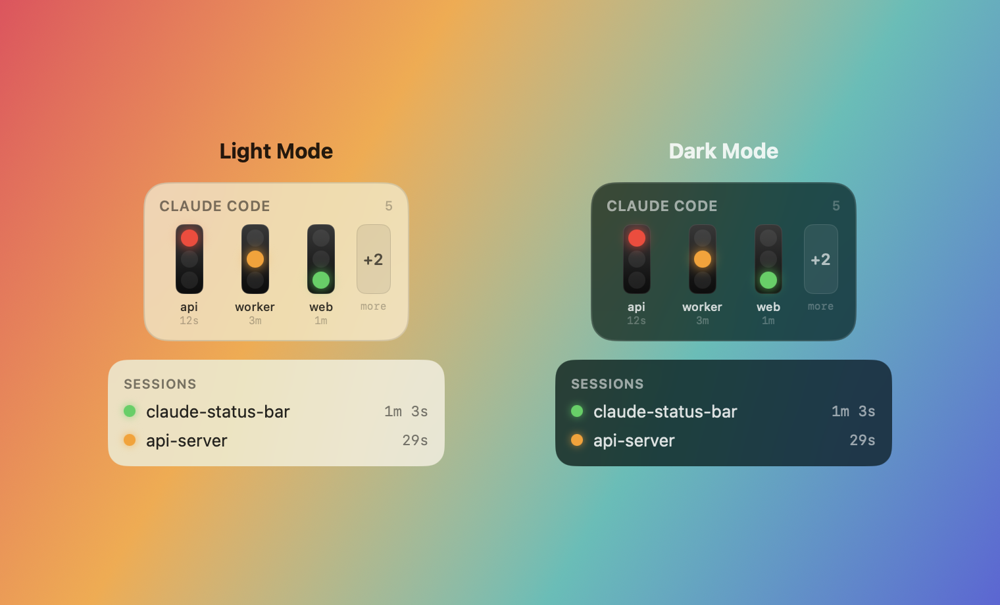
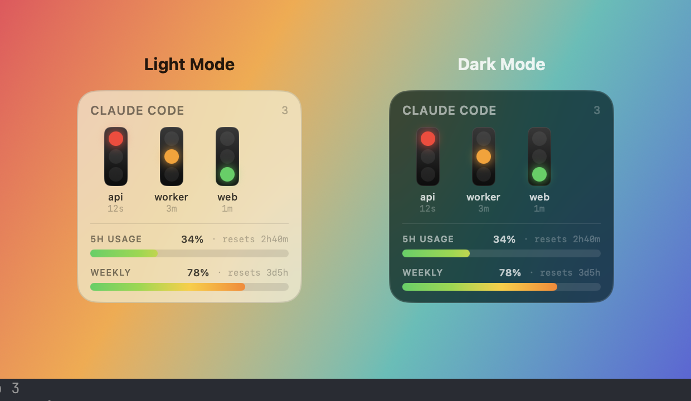

# 🚦 Claude Status Bar


Una luz de estado ambiental para [Claude Code](https://claude.com/claude-code). Un punto en la barra de menú y un panel flotante de cristal opcional muestran, de un vistazo, si cada sesión está **🔴 esperándote**, **🟡 ejecutándose** o **🟢 terminada** — impulsado automáticamente por los hooks de Claude Code, con notificaciones de escritorio en las transiciones que importan.

Sin conexión a red, sin telemetría. Todo son archivos locales bajo `~/.claude/`.



## 📋 Requisitos

- macOS 14 (Sonoma) o posterior
- Cadena de herramientas Swift (Xcode **o** Command Line Tools: `xcode-select --install`)

## 🚀 Instalación (CLI)

Todo se instala desde la terminal: sin proyecto de Xcode, sin App Store.

```bash
git clone https://github.com/AdilHoumadi/claude-status-bar.git
cd claude-status-bar
./scripts/install.sh
```

`./scripts/install.sh` lo hace todo:

1. compila un binario de lanzamiento (`swift build -c release`),
2. lo empaqueta en `ClaudeStatusBar.app` (firmado ad-hoc),
3. lo copia a **`~/Applications`** (su ubicación permanente),
4. conecta los hooks en `~/.claude/settings.json` — se preservan los hooks existentes y se escribe un `.bak`,
5. lo inicia — aparece un punto en tu barra de menú.

Volver a ejecutarlo es seguro: los hooks se fusionan de forma idempotente (sin duplicados) y reinstalar en la misma ruta preserva tu permiso de notificaciones.

Abre una sesión **nueva** de Claude Code después — una sesión carga sus hooks al inicio, por lo que las sesiones ya en ejecución no se actualizarán hasta que se reinicien.

> **Mantén una sola copia.** La aplicación vive en `~/Applications` e **Iniciar al entrar** la registra desde allí. No la copies también a `/Applications` — una segunda copia con el mismo ID de paquete oscurece las actualizaciones (la antigua sigue lanzándose) y es un dolor de cabeza de resolver. Elige una ubicación.

### 🔄 Actualizar

```bash
git pull
./scripts/install.sh   # recompila, reemplaza ~/Applications, reconecta los hooks
```

Si hay una instancia antigua aún en ejecución, ciérrala desde el menú (o `killall ClaudeStatusBarApp`) antes de reiniciarla para que la nueva compilación tome el control.

### 📦 O descarga un .dmg

`./scripts/dmg.sh` genera `dist/ClaudeStatusBar.dmg` (arrastrar a Aplicaciones). Está firmado ad-hoc (no notariado), por lo que en el primer lanzamiento **haz clic derecho en la app → Abrir**, o ejecuta:

```bash
xattr -dr com.apple.quarantine /Applications/ClaudeStatusBar.app
```

Luego haz clic en el punto de la barra de menú → **Instalar hooks** (o ejecuta
`~/.claude/statusbar/bin/claude-statusbar-hook --install`) para conectarlo a Claude Code.

## 👀 Uso

Todo reside en el menú desplegable de la barra de menú: haz clic en el punto para abrirlo.

- **Punto de la barra de menú** — estado agregado de todas las sesiones (prevalece el peor estado).
- **Sesiones** — lista por sesión: nombre del proyecto y tiempo en el estado actual.
- **Luces flotantes** — un panel de cristal siempre visible con un semáforo por sesión (peor primero, chip de desbordamiento `+N`). El ancho se adapta a la cantidad mostrada. Arrástralo a cualquier lugar; la posición se recuerda.
- **Opciones**:
  - **Notificaciones** / **Sonido** — banners (y sonido) en las transiciones que importan.
  - **Apariencia** — Sistema / Claro / Oscuro, aplicado a ambas superficies.
  - **Opacidad** — atenúa el menú desplegable y el panel flotante juntos.
  - **Luces flotantes** — alternar el panel, más un control deslizante de **Luces máximas** (1–5) que limita cuántas se muestran antes del chip `+N`.
  - **Iniciar al entrar**.
- **Proyectos ignorados** — un prefijo de ruta por línea; las sesiones en esas carpetas se ocultan (útil para ejecuciones sin interfaz/automatizadas de `claude -p`).
- **Instalar hooks / Desinstalar** — conectar los hooks a Claude Code, o eliminarlos.

Las sesiones de CLI, extensiones de IDE y Code / Cowork de Claude Desktop están cubiertas — ejecutan el motor de Claude Code y disparan los mismos hooks.

## 📊 Barras de uso — 5 horas + semanales (opcional)

El panel flotante (y el menú desplegable) puede mostrar cargadores de **uso** coloridos: una barra de **5 horas** y, cuando esté disponible, una barra **semanal** (verde → amarillo → rojo a medida que te acercas a cada límite, con una cuenta regresiva de reinicio). Habilita las barras flotantes en **Opciones → Barra de uso 5h**; el menú desplegable las muestra automáticamente siempre que existan datos de uso.



Claude Code solo expone los números reales de límite de tasa a un comando **statusline** (nunca a hooks o archivos — es una función nativa de Claude Code, no un complemento), por lo que esto es optativo: apunta la statusline al modo `--usage-snapshot` del asistente. Escribe `~/.claude/statusbar/usage.json` para que la app lo lea **y** imprime una línea de terminal compacta y con código de color
(`Opus 4.8 · claude-status-bar · ctx 40% · 5h 8% · wk 32%`). Sin nuevo software: reutiliza el asistente que ya tienes; funciona en planes de suscripción de Claude (Pro/Max), no en API/Bedrock/Vertex.

Configúralo como tu statusline (`settings.json`):

```json
{ "statusLine": { "type": "command",
  "command": "~/.claude/statusbar/bin/claude-statusbar-hook --usage-snapshot" } }
```

Claude Code permite una statusline. Si **ya** ejecutas una (p. ej., un HUD) y quieres conservarla, envuelve ambas: el escritor de instantáneas y tu línea existente:

```bash
#!/bin/bash
input=$(cat)
printf '%s' "$input" | ~/.claude/statusbar/bin/claude-statusbar-hook --usage-snapshot >/dev/null
printf '%s' "$input" | <tu comando de statusline existente>
```

Hasta que exista una instantánea, la barra permanece oculta (sin datos falsos). El número coincide con el `/usage` propio de Claude porque *es* el número de Claude.

## 🚦 Modelo de estado

| Evento de hook | Estado |
|---|---|
| `Notification` (`permission_prompt` / `idle_prompt`) | 🔴 esperándote |
| `UserPromptSubmit`, `PreToolUse`, `PostToolUse` | 🟡 ejecutándose |
| `Stop` | 🟢 terminado / inactivo |
| `SessionStart` / `SessionEnd` | crear / eliminar la sesión |

## ⚙️ Cómo funciona

```
Claude Code ──hook (sync)──▶ claude-statusbar-hook ──▶ ~/.claude/statusbar/<id>.json
                                                              │ (consultado cada 0.5s)
                                              app de barra de menú + panel flotante
```

Los hooks son síncronos, fallan abiertamente (siempre salen con 0) y se llaman por ruta absoluta: nunca bloquean ni fallan un turno de Claude Code. El asistente instalado reside en una ruta estable
(`~/.claude/statusbar/bin/`) para que las actualizaciones de la app no rompan los hooks.

## 🪝 Gestionar hooks desde la CLI

```bash
~/.claude/statusbar/bin/claude-statusbar-hook --install     # conectar (idempotente)
~/.claude/statusbar/bin/claude-statusbar-hook --uninstall   # eliminar los nuestros; deja los demás intactos
```

## 🧹 Desinstalar

```bash
~/.claude/statusbar/bin/claude-statusbar-hook --uninstall
rm -rf ~/Applications/ClaudeStatusBar.app ~/.claude/statusbar
```

## 🩺 Solución de problemas

- **Sin notificaciones** — apruébalas en Configuración del Sistema → Notificaciones → ClaudeStatusBar.
  Las notificaciones solo se activan desde el `.app` empaquetado (no desde `swift run` en crudo).
- **El punto no se mueve** — asegúrate de haber abierto una sesión *nueva* después de instalar; verifica que aparezca un archivo de estado: `ls ~/.claude/statusbar/`.
- **"Iniciar al entrar" no persiste / una compilación antigua sigue lanzándose** — asegúrate de que solo haya
  **una** copia de la app. Un duplicado en `/Applications` y `~/Applications` comparte un ID de
  paquete, por lo que se lanza la incorrecta al iniciar sesión y oscurece las actualizaciones. Mantén la copia de `~/Applications`, elimina la otra (`sudo rm -rf /Applications/ClaudeStatusBar.app`) y cambia **Iniciar
  al entrar** de off/on para volver a registrarla.

## 🛠️ Desarrollo

```bash
swift run ClaudeStatusBarTests   # suite completa de pruebas (arnés sin dependencias)
swift build                      # compilar todos los objetivos
./scripts/bundle.sh              # compilar solo el .app
```

El código fuente es un paquete SwiftPM: `StatusCore` (modelo de estado), `StatusStore` (asistente de hooks +
archivos de estado), `StatusApp` (modelo de vista, notificaciones, selección flotante),
`StatusInstall` (instalador de settings.json) y la cáscara SwiftUI de `ClaudeStatusBarApp`.

## 📤 Distribución

El paquete está **firmado ad-hoc** — perfecto para tu propia máquina. Compartirlo con otras Mac
requiere un certificado de Developer ID y notariado (una cuenta de Apple Developer).
