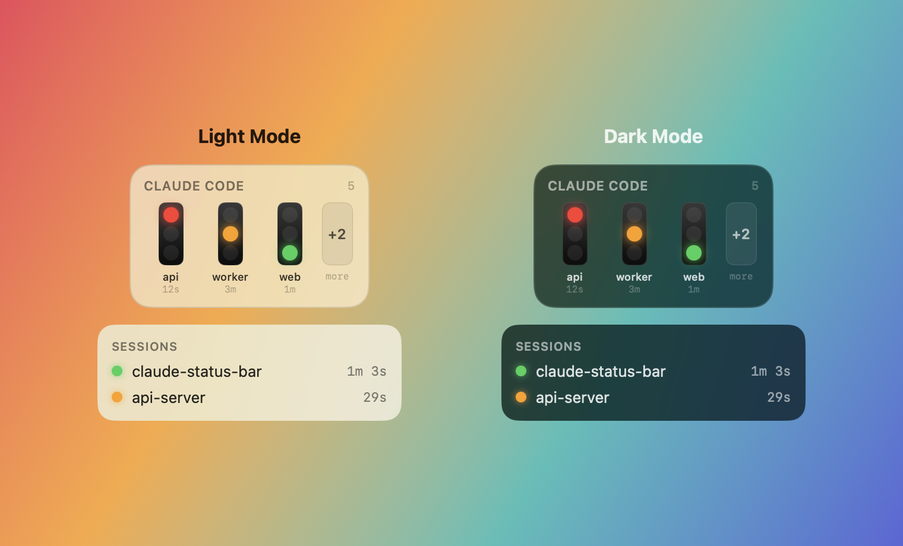

# 🚦 Claude Status Bar


An ambient status light for [Claude Code](https://claude.com/claude-code). A menu-bar
dot and an optional floating glass panel show, at a glance, whether each session is
**🔴 waiting for you**, **🟡 running**, or **🟢 done** — driven automatically by Claude
Code hooks, with desktop notifications on the transitions that matter.

No network, no telemetry. Everything is local files under `~/.claude/`.



## 📋 Requirements

- macOS 14 (Sonoma) or later
- Swift toolchain (Xcode **or** Command Line Tools: `xcode-select --install`)

## 🚀 Install (CLI)

Everything installs from the terminal — no Xcode project, no App Store.

```bash
git clone https://github.com/AdilHoumadi/claude-status-bar.git
cd claude-status-bar
./scripts/install.sh
```

`./scripts/install.sh` does the whole thing:

1. builds a release binary (`swift build -c release`),
2. bundles it into `ClaudeStatusBar.app` (ad-hoc signed),
3. copies it to **`~/Applications`** (its permanent home),
4. wires the hooks into `~/.claude/settings.json` — your existing hooks are preserved and
   a `.bak` is written,
5. launches it — a dot appears in your menu bar.

Re-running is safe: hooks merge idempotently (no duplicates), and reinstalling to the same
path preserves your notification permission.

Open a **new** Claude Code session afterwards — a session loads its hooks at startup, so
sessions already running won't light up until they restart.

> **Keep one copy.** The app lives in `~/Applications` and **Start at login** registers it
> from there. Don't also copy it to `/Applications` — a second copy with the same bundle id
> shadows updates (the old one keeps launching) and is a pain to untangle. Pick one location.

### 🔄 Update

```bash
git pull
./scripts/install.sh   # rebuilds, replaces ~/Applications, re-wires hooks
```

If an old instance is still running, quit it from the menu (or `killall ClaudeStatusBarApp`)
before relaunching so the new build takes over.

### 📦 Or grab a .dmg

`./scripts/dmg.sh` builds `dist/ClaudeStatusBar.dmg` (drag-to-Applications). It's ad-hoc
signed (not notarized), so on first launch **right-click the app → Open**, or run:

```bash
xattr -dr com.apple.quarantine /Applications/ClaudeStatusBar.app
```

Then click the menu-bar dot → **Install hooks** (or run
`~/.claude/statusbar/bin/claude-statusbar-hook --install`) to wire it into Claude Code.

## 👀 Using it

Everything lives in the menu-bar dropdown — click the dot to open it.

- **Menu bar dot** — aggregate state across all sessions (worst-state-wins).
- **Sessions** — per-session list: project name and time in the current state.
- **Floating lights** — an always-on-top glass panel with a road traffic-light per session
  (worst-first, `+N` overflow chip). The width adapts to how many are shown. Drag it
  anywhere; the position is remembered.
- **Options**:
  - **Notifications** / **Sound** — banners (and sound) on the transitions that matter.
  - **Appearance** — System / Light / Dark, applied to both surfaces.
  - **Opacity** — dims the dropdown and the floating panel together.
  - **Floating lights** — toggle the panel, plus a **Max lights** slider (1–5) capping how
    many show before the `+N` chip.
  - **Start at login**.
- **Ignored projects** — one path prefix per line; sessions under those folders are hidden
  (handy for headless/automated `claude -p` runs).
- **Install hooks / Uninstall** — wire the hooks into Claude Code, or remove them.

CLI, IDE extensions, and Claude Desktop's Code / Cowork sessions are all covered — they run
the Claude Code engine and fire the same hooks.

## 📊 5-hour usage bar (optional)

The floating panel can show a colourful **5-hour usage** loader at the bottom (green → yellow
→ red as you approach the limit, with a reset countdown). Enable it in **Options → 5h usage bar**.

Claude Code only exposes the real rate-limit numbers to a **statusline** command (never to hooks
or any file), so this is opt-in: point a statusline at the helper's `--usage-snapshot` mode, which
writes `~/.claude/statusbar/usage.json` for the app to read. No new software — it reuses the helper
you already have; works on Claude subscription plans (Pro/Max), not API/Bedrock/Vertex.

If you have **no** statusline, set it to the helper directly (`settings.json`):

```json
{ "statusLine": { "type": "command",
  "command": "~/.claude/statusbar/bin/claude-statusbar-hook --usage-snapshot" } }
```

If you **already** run a statusline (e.g. a HUD), wrap it so both run — the snapshot writer and
your existing line:

```bash
#!/bin/bash
input=$(cat)
printf '%s' "$input" | ~/.claude/statusbar/bin/claude-statusbar-hook --usage-snapshot
printf '%s' "$input" | <your existing statusline command>
```

Until a snapshot exists the bar stays hidden (no fake data). The number matches Claude's own
`/usage` because it *is* Claude's number.

## 🚦 State model

| Hook event | State |
|---|---|
| `Notification` (`permission_prompt` / `idle_prompt`) | 🔴 waiting for you |
| `UserPromptSubmit`, `PreToolUse`, `PostToolUse` | 🟡 running |
| `Stop` | 🟢 done / idle |
| `SessionStart` / `SessionEnd` | create / remove the session |

## ⚙️ How it works

```
Claude Code ──hook (sync)──▶ claude-statusbar-hook ──▶ ~/.claude/statusbar/<id>.json
                                                              │ (polled every 0.5s)
                                              menu-bar app + floating panel
```

Hooks are synchronous, fail-open (always exit 0), and called by absolute path — they
never block or fail a Claude Code turn. The installed helper lives at a stable path
(`~/.claude/statusbar/bin/`) so app updates don't break the hooks.

## 🪝 Manage hooks from the CLI

```bash
~/.claude/statusbar/bin/claude-statusbar-hook --install     # wire up (idempotent)
~/.claude/statusbar/bin/claude-statusbar-hook --uninstall   # remove ours; leaves others intact
```

## 🧹 Uninstall

```bash
~/.claude/statusbar/bin/claude-statusbar-hook --uninstall
rm -rf ~/Applications/ClaudeStatusBar.app ~/.claude/statusbar
```

## 🩺 Troubleshooting

- **No notifications** — approve them in System Settings → Notifications → ClaudeStatusBar.
  Notifications only fire from the bundled `.app` (not bare `swift run`).
- **Dot doesn't move** — make sure you opened a *new* session after installing; check a
  state file appears: `ls ~/.claude/statusbar/`.
- **"Start at login" won't stick / an old build keeps launching** — make sure there's only
  **one** copy of the app. A duplicate in `/Applications` and `~/Applications` share a bundle
  id, so the wrong one launches at login and shadows updates. Keep the `~/Applications` copy
  and delete the other (`sudo rm -rf /Applications/ClaudeStatusBar.app`), then toggle **Start
  at login** off/on to re-register.

## 🛠️ Development

```bash
swift run ClaudeStatusBarTests   # full test suite (dependency-free harness)
swift build                      # build all targets
./scripts/bundle.sh              # build the .app only
```

Source is a SwiftPM package: `StatusCore` (state model), `StatusStore` (hook helper +
state files), `StatusApp` (view-model, notifications, floating selection),
`StatusInstall` (settings.json installer), and the `ClaudeStatusBarApp` SwiftUI shell.

## 📤 Distribution

The bundle is **ad-hoc signed** — fine for your own machine. Sharing it with other Macs
requires a Developer ID certificate and notarization (an Apple Developer account).
